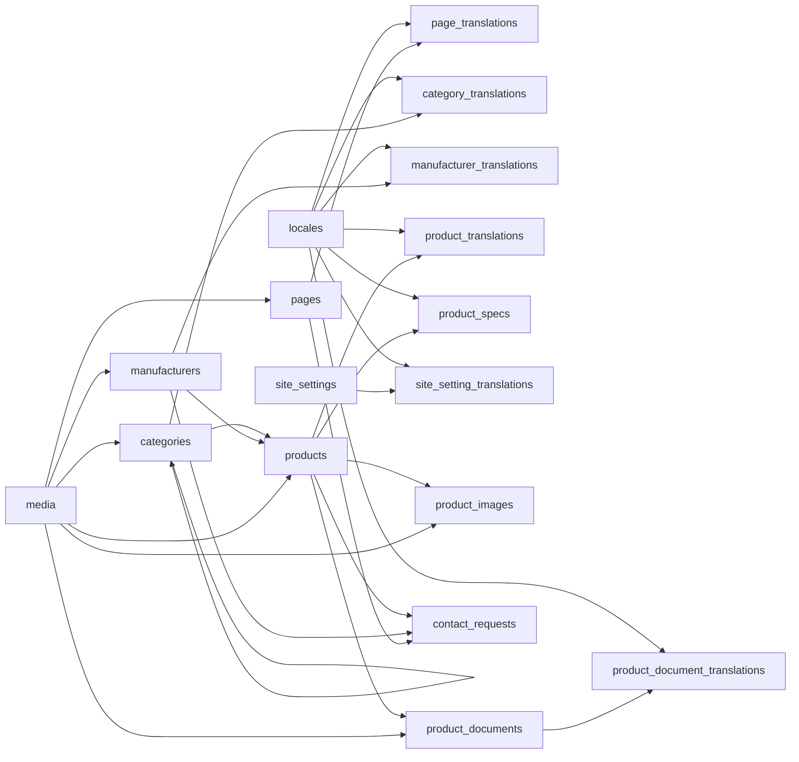

# Domain Model And Data Model

## Modeling principles

- Use language-neutral base entities for operational truth
- Use translation tables for public text, slugs, and SEO fields
- Keep the model structured enough for SEO and editorial control, but avoid turning the CMS into a full PIM/DAM platform
- Treat publication as a two-layer gate:
  - base entity publication
  - per-locale translation publication
- Keep Persian in the model from day one, but not publicly routable until explicitly enabled
- Model category hierarchy from day one instead of retrofitting subcategories later
- Model product pricing as optional public information, never as transactional commerce
- Store inquiries and product documents inside the main application model with no required paid third-party dependency

## Relationship summary

## Cross-cutting rules

- Every translation row belongs to exactly one locale
- Every publishable translation row must have a locale-specific slug or slug segment where the entity is routable
- Public output is allowed only when:
  - locale visibility is `public`
  - base entity publish status is `published`
  - translation publish status is `published`
  - required content completeness checks pass
- Product pages require exactly one category node and one manufacturer in MVP
- Manufacturer means the main product producer/brand only in MVP
- Supplier, partner, reseller, and distributor concepts are intentionally out of scope in MVP
- Category hierarchy must not allow cyclical parent-child relationships
- Deleting a category or manufacturer that still has products should be blocked at the application level
- Slug changes should create redirect entries in the future build, even if redirects are not a separate MVP entity yet
- If a product has no public price, the product page must render a localized contact-for-pricing message instead

## Enum definitions

### `publish_status`

- `draft`: work in progress, never public
- `review`: internally ready for review, never public
- `published`: allowed to appear publicly if the locale is public and completeness checks pass
- `archived`: no longer public, kept for history or future reuse

### `availability_status`

- `in_stock`: immediately available
- `available_on_request`: not necessarily on hand, but can be sourced or confirmed after contact
- `out_of_stock`: currently unavailable
- `discontinued`: no longer offered

### `inquiry_status`

- `new`: newly received, not yet processed
- `qualified`: reviewed and considered relevant
- `answered`: initial response sent
- `closed`: completed or no further action required
- `spam`: irrelevant or malicious submission

### `locale_visibility_status`

- `disabled`: locale exists in configuration but is not editable or usable
- `internal_only`: locale can be edited and previewed in admin but is never public
- `public`: locale is publicly routable and indexable if content is published

### Recommended supporting enums

- `page_key`: `home`, `about`, `products_index`, `categories_index`, `manufacturers_index`, `contact`, optionally `privacy`, `legal`
- `contact_request_type`: `general`, `product_inquiry`, `manufacturer_inquiry`, `pricing_request`
- `media_kind`: `image`, `document`
- `product_document_type`: `datasheet`, `catalog`, `certificate`, `brochure`, `other`

## Entity specifications

## `locales`

- Purpose: define which locales exist, how they behave, and whether they are public
- Key fields:
  - `code` (`en`, `fr`, `fa`)
  - `label`
  - `native_label`
  - `direction` (`ltr`, `rtl`)
  - `visibility_status`
  - `is_default_public`
  - `sort_order`
- Required fields:
  - `code`
  - `label`
  - `direction`
  - `visibility_status`
- Optional fields:
  - `native_label`
  - `launch_date`
- Relationships:
  - one locale to many translation rows across all translation tables
- Constraints:
  - `code` must be unique
  - only one locale should be `is_default_public = true`
  - `en` should start as the default public locale
  - `fa` should start as `internal_only`
- Publication behavior:
  - this entity controls whether translations in that locale can become public
- Locale behavior:
  - self-referential configuration entity
- SEO-relevant fields:
  - `code`
  - `visibility_status`
  - `is_default_public`

## `pages`

- Purpose: store language-neutral page identity and routing intent for system/editorial pages
- Key fields:
  - `id`
  - `page_key`
  - `publish_status`
  - `is_system_page`
  - `sort_order`
  - `show_in_navigation`
- Required fields:
  - `page_key`
  - `publish_status`
- Optional fields:
  - `hero_media_id`
  - `template_variant`
  - `navigation_group`
- Relationships:
  - one page to many `page_translations`
  - optional media reference
  - optional link from `contact_requests.source_page_id`
- Constraints:
  - `page_key` unique
  - system pages like `home`, `about`, `products_index`, `categories_index`, `manufacturers_index`, and `contact` should exist exactly once
- Publication behavior:
  - base page must be `published` before any translation becomes public
- Locale behavior:
  - page text and slug live in `page_translations`
- SEO-relevant fields:
  - `publish_status`
  - `show_in_navigation`

## `page_translations`

- Purpose: store per-locale page content and metadata
- Key fields:
  - `id`
  - `page_id`
  - `locale_code`
  - `title`
  - `slug`
  - `summary`
  - `content_blocks_json`
  - `seo_title`
  - `seo_description`
  - `og_title`
  - `og_description`
  - `publish_status`
- Required fields:
  - `page_id`
  - `locale_code`
  - `title`
  - `publish_status`
- Optional fields:
  - `slug` for routed non-home pages
  - `summary`
  - `content_blocks_json`
  - `seo_title`
  - `seo_description`
  - `og_title`
  - `og_description`
  - `hero_heading`
- Relationships:
  - belongs to `pages`
  - belongs to `locales`
- Constraints:
  - unique (`page_id`, `locale_code`)
  - slug unique per locale among page translations where page is routed
- Publication behavior:
  - public only when both the page and this translation are `published`
- Locale behavior:
  - each public locale gets its own translation row
  - `fa` rows may be drafted or reviewed without public output
- SEO-relevant fields:
  - `slug`
  - `title`
  - `summary`
  - `seo_title`
  - `seo_description`
  - `og_title`
  - `og_description`

## `categories`

- Purpose: store language-neutral category identity used by products and public landing pages
- Key fields:
  - `id`
  - `code`
  - `parent_id`
  - `publish_status`
  - `sort_order`
  - `depth`
  - `is_featured`
  - `hero_media_id`
- Required fields:
  - `code`
  - `publish_status`
- Optional fields:
  - `parent_id`
  - `sort_order`
  - `depth`
  - `is_featured`
  - `hero_media_id`
- Relationships:
  - one category to many `category_translations`
  - one parent category to many child categories
  - one category to many `products`
- Constraints:
  - `code` unique
  - `parent_id` optional for top-level categories
  - no cyclical ancestry
  - cannot be hard-deleted while referenced by products or child categories
- Publication behavior:
  - base category must be `published` for locale pages to go public
- Locale behavior:
  - visible text and slug path data live in `category_translations`
- SEO-relevant fields:
  - `is_featured`
  - `publish_status`
  - `hero_media_id`
  - `depth`

## `category_translations`

- Purpose: store per-locale category landing-page content and path segments
- Key fields:
  - `id`
  - `category_id`
  - `locale_code`
  - `name`
  - `slug_segment`
  - `full_slug_path_cache`
  - `short_description`
  - `body`
  - `seo_title`
  - `seo_description`
  - `publish_status`
- Required fields:
  - `category_id`
  - `locale_code`
  - `name`
  - `slug_segment`
  - `publish_status`
- Optional fields:
  - `full_slug_path_cache`
  - `short_description`
  - `body`
  - `seo_title`
  - `seo_description`
  - `faq_json`
- Relationships:
  - belongs to `categories`
  - belongs to `locales`
- Constraints:
  - unique (`category_id`, `locale_code`)
  - `slug_segment` should be unique among siblings for the same locale
  - `full_slug_path_cache` should be unique per locale among category pages
- Publication behavior:
  - public only when base category and translation are both `published`
- Locale behavior:
  - slug path is localized
  - no public fallback to another locale
- SEO-relevant fields:
  - `name`
  - `slug_segment`
  - `full_slug_path_cache`
  - `short_description`
  - `body`
  - `seo_title`
  - `seo_description`

## `manufacturers`

- Purpose: store language-neutral producer/brand identity for public catalog pages
- Key fields:
  - `id`
  - `code`
  - `publish_status`
  - `origin_country`
  - `website_url`
  - `logo_media_id`
  - `hero_media_id`
  - `is_featured`
  - `sort_order`
- Required fields:
  - `code`
  - `publish_status`
- Optional fields:
  - `origin_country`
  - `website_url`
  - `logo_media_id`
  - `hero_media_id`
  - `is_featured`
  - `sort_order`
- Relationships:
  - one manufacturer to many `manufacturer_translations`
  - one manufacturer to many `products`
- Constraints:
  - `code` unique
  - cannot be removed while referenced by products
  - manufacturer means producer/brand only, not a supplier or reseller record
- Publication behavior:
  - base record must be `published`
- Locale behavior:
  - public text and slug live in `manufacturer_translations`
- SEO-relevant fields:
  - `origin_country`
  - `is_featured`
  - `logo_media_id`

## `manufacturer_translations`

- Purpose: store localized manufacturer profile content
- Key fields:
  - `id`
  - `manufacturer_id`
  - `locale_code`
  - `name`
  - `slug`
  - `summary`
  - `body`
  - `seo_title`
  - `seo_description`
  - `publish_status`
- Required fields:
  - `manufacturer_id`
  - `locale_code`
  - `name`
  - `slug`
  - `publish_status`
- Optional fields:
  - `summary`
  - `body`
  - `seo_title`
  - `seo_description`
  - `certifications_text`
- Relationships:
  - belongs to `manufacturers`
  - belongs to `locales`
- Constraints:
  - unique (`manufacturer_id`, `locale_code`)
  - slug unique per locale among manufacturer pages
- Publication behavior:
  - public only when both base and translation statuses are `published`
- Locale behavior:
  - each locale owns its own name and slug
- SEO-relevant fields:
  - `name`
  - `slug`
  - `summary`
  - `body`
  - `seo_title`
  - `seo_description`

## `products`

- Purpose: store language-neutral product identity and operational catalog truth
- Key fields:
  - `id`
  - `sku`
  - `category_id`
  - `manufacturer_id`
  - `publish_status`
  - `availability_status`
  - `public_price_amount`
  - `public_price_currency`
  - `public_price_unit_label`
  - `price_last_verified_at`
  - `is_featured`
  - `primary_image_media_id`
  - `sort_order`
- Required fields:
  - `category_id`
  - `manufacturer_id`
  - `publish_status`
  - `availability_status`
- Optional fields:
  - `sku`
  - `public_price_amount`
  - `public_price_currency`
  - `public_price_unit_label`
  - `price_last_verified_at`
  - `primary_image_media_id`
  - `sort_order`
  - `is_featured`
  - `internal_notes`
- Relationships:
  - belongs to one `categories`
  - belongs to one `manufacturers`
  - one product to many `product_translations`
  - one product to many `product_images`
  - one product to many `product_specs`
  - one product to many `product_documents`
  - optional link from `contact_requests`
- Constraints:
  - one product must have exactly one category node and one manufacturer in MVP
  - `sku` should be unique when present
  - `primary_image_media_id` should reference a valid image media row
  - if `public_price_amount` is set, `public_price_currency` is required
- Publication behavior:
  - base product must be `published` before any locale page is public
- Locale behavior:
  - localized text and slug live in `product_translations`
  - specs are stored as locale-scoped rows in `product_specs`
- SEO-relevant fields:
  - `availability_status`
  - `public_price_amount`
  - `public_price_currency`
  - `primary_image_media_id`
  - `is_featured`

## `product_translations`

- Purpose: store localized product detail content and SEO fields
- Key fields:
  - `id`
  - `product_id`
  - `locale_code`
  - `name`
  - `slug`
  - `short_description`
  - `long_description`
  - `availability_note`
  - `contact_for_pricing_message`
  - `seo_title`
  - `seo_description`
  - `publish_status`
- Required fields:
  - `product_id`
  - `locale_code`
  - `name`
  - `slug`
  - `short_description`
  - `publish_status`
- Optional fields:
  - `long_description`
  - `availability_note`
  - `contact_for_pricing_message`
  - `seo_title`
  - `seo_description`
  - `meta_keywords` if ever needed internally
- Relationships:
  - belongs to `products`
  - belongs to `locales`
- Constraints:
  - unique (`product_id`, `locale_code`)
  - slug unique per locale among product pages
  - if the product has no `public_price_amount`, a localized `contact_for_pricing_message` is strongly recommended before publication
- Publication behavior:
  - public only when base product and translation are both `published`
- Locale behavior:
  - no cross-locale public fallback
- SEO-relevant fields:
  - `name`
  - `slug`
  - `short_description`
  - `long_description`
  - `availability_note`
  - `contact_for_pricing_message`
  - `seo_title`
  - `seo_description`

## `product_images`

- Purpose: connect products to ordered media assets
- Key fields:
  - `id`
  - `product_id`
  - `media_id`
  - `sort_order`
  - `is_primary`
  - `alt_hint`
- Required fields:
  - `product_id`
  - `media_id`
  - `sort_order`
- Optional fields:
  - `is_primary`
  - `alt_hint`
- Relationships:
  - belongs to `products`
  - belongs to `media`
- Constraints:
  - one product can have many images
  - only one `is_primary = true` per product
- Publication behavior:
  - follows parent product publication
- Locale behavior:
  - images are shared assets
  - alt text should be generated from localized product name plus optional `alt_hint`
- SEO-relevant fields:
  - `is_primary`
  - `alt_hint`
  - `sort_order`

## `product_specs`

- Purpose: store locale-aware technical or descriptive spec rows without creating another translation table
- Key fields:
  - `id`
  - `product_id`
  - `locale_code`
  - `label`
  - `value`
  - `unit`
  - `sort_order`
  - `is_highlight`
- Required fields:
  - `product_id`
  - `locale_code`
  - `label`
  - `value`
  - `sort_order`
- Optional fields:
  - `unit`
  - `is_highlight`
- Relationships:
  - belongs to `products`
  - belongs to `locales`
- Constraints:
  - specs are locale-scoped rows
  - duplicate spec labels for the same product/locale should be prevented unless intentionally versioned
- Publication behavior:
  - follows the parent product and locale translation publication
- Locale behavior:
  - label and value can both be localized
  - useful for EN/FR divergence in terminology
- SEO-relevant fields:
  - `label`
  - `value`
  - `is_highlight`

## `product_documents`

- Purpose: attach ordered documents to products for optional public download
- Key fields:
  - `id`
  - `product_id`
  - `media_id`
  - `document_type`
  - `is_public`
  - `sort_order`
- Required fields:
  - `product_id`
  - `media_id`
  - `document_type`
  - `is_public`
  - `sort_order`
- Optional fields:
  - `expires_at`
  - `internal_notes`
- Relationships:
  - belongs to `products`
  - belongs to `media`
  - one product document to many `product_document_translations`
- Constraints:
  - only document-kind media may be attached
  - a product can have multiple documents
- Publication behavior:
  - follows parent product publication, plus `is_public = true`
- Locale behavior:
  - label/description belong in `product_document_translations`
- SEO-relevant fields:
  - `document_type`
  - `is_public`
  - `sort_order`

## `product_document_translations`

- Purpose: store localized labels and summaries for public product documents
- Key fields:
  - `id`
  - `product_document_id`
  - `locale_code`
  - `label`
  - `description`
  - `publish_status`
- Required fields:
  - `product_document_id`
  - `locale_code`
  - `label`
  - `publish_status`
- Optional fields:
  - `description`
- Relationships:
  - belongs to `product_documents`
  - belongs to `locales`
- Constraints:
  - unique (`product_document_id`, `locale_code`)
- Publication behavior:
  - public only when parent product is public, document is `is_public = true`, and this translation is `published`
- Locale behavior:
  - document labels can be localized or intentionally omitted for non-public locales
- SEO-relevant fields:
  - `label`
  - `description`

## `media`

- Purpose: central asset store for images and downloadable files
- Key fields:
  - `id`
  - `kind`
  - `storage_key`
  - `public_url`
  - `mime_type`
  - `width`
  - `height`
  - `bytes`
  - `original_filename`
  - `title`
- Required fields:
  - `kind`
  - `storage_key`
  - `mime_type`
- Optional fields:
  - `public_url`
  - `width`
  - `height`
  - `bytes`
  - `original_filename`
  - `title`
  - `focal_point_x`
  - `focal_point_y`
- Relationships:
  - referenced by pages, categories, manufacturers, products, product_images, and product_documents
- Constraints:
  - storage key unique
  - image dimensions required for image records when available
- Publication behavior:
  - media itself is not published separately; visibility follows referencing entities
- Locale behavior:
  - shared asset, not localized by default
- SEO-relevant fields:
  - `title`
  - image dimensions
  - file type

## `contact_requests`

- Purpose: store inbound B2B inquiries from the public site
- Key fields:
  - `id`
  - `request_type`
  - `status`
  - `source_locale_code`
  - `source_page_id`
  - `product_id`
  - `manufacturer_id`
  - `company_name`
  - `contact_name`
  - `email`
  - `phone`
  - `country`
  - `message`
  - `consent_to_contact`
  - `utm_source`
  - `utm_medium`
  - `utm_campaign`
- Required fields:
  - `status`
  - `source_locale_code`
  - `contact_name`
  - `email`
  - `message`
  - `consent_to_contact`
- Optional fields:
  - `request_type`
  - `source_page_id`
  - `product_id`
  - `manufacturer_id`
  - `company_name`
  - `phone`
  - `country`
  - UTM fields
  - `internal_notes`
- Relationships:
  - may reference one `products`
  - may reference one `manufacturers`
  - may reference one `pages`
  - belongs to one locale via `source_locale_code`
- Constraints:
  - must allow general inquiries without a linked product/manufacturer
  - should keep immutable source-page context for auditability
- Publication behavior:
  - never public
- Locale behavior:
  - stores source locale for routing and response context
- SEO-relevant fields:
  - none directly, but source attribution helps conversion analysis

## `site_settings`

- Purpose: store global, mostly non-translatable site configuration
- Key fields:
  - `id`
  - `default_locale_code`
  - `public_locales_json`
  - `contact_email`
  - `phone`
  - `address_json`
  - `social_links_json`
  - `main_navigation_json`
  - `footer_navigation_json`
  - `default_share_image_media_id`
  - `search_console_verification`
- Required fields:
  - `default_locale_code`
  - `public_locales_json`
  - `contact_email`
- Optional fields:
  - `phone`
  - `address_json`
  - `social_links_json`
  - navigation JSON
  - `default_share_image_media_id`
  - `search_console_verification`
- Relationships:
  - one settings record to many `site_setting_translations`
  - optional media reference
- Constraints:
  - singleton row in MVP
- Publication behavior:
  - global settings affect public site immediately after publish/approval
- Locale behavior:
  - non-translatable operational fields live here
- SEO-relevant fields:
  - `default_locale_code`
  - `public_locales_json`
  - `default_share_image_media_id`
  - `search_console_verification`

## `site_setting_translations`

- Purpose: store translatable global copy and SEO defaults
- Key fields:
  - `id`
  - `site_settings_id`
  - `locale_code`
  - `site_name`
  - `site_tagline`
  - `default_meta_title_suffix`
  - `default_meta_description`
  - `footer_company_blurb`
  - `contact_intro`
  - `default_contact_for_pricing_message`
- Required fields:
  - `site_settings_id`
  - `locale_code`
  - `site_name`
- Optional fields:
  - `site_tagline`
  - `default_meta_title_suffix`
  - `default_meta_description`
  - `footer_company_blurb`
  - `contact_intro`
  - `default_contact_for_pricing_message`
- Relationships:
  - belongs to `site_settings`
  - belongs to `locales`
- Constraints:
  - unique (`site_settings_id`, `locale_code`)
- Publication behavior:
  - follows site locale visibility and overall site publish policy
- Locale behavior:
  - each locale can customize shared meta suffix, footer language, and fallback contact-for-pricing copy
- SEO-relevant fields:
  - `site_name`
  - `default_meta_title_suffix`
  - `default_meta_description`

## Notes on entities intentionally not required in MVP

- No separate `orders`
- No separate `inventory_movements`
- No public `users`
- No free-form page-builder table
- No supplier/reseller/partner entity layer
- No separate `manufacturer_product_links` because product belongs to one manufacturer in MVP
- No dedicated `redirects` table in this conceptual minimum, though redirect handling is strongly recommended during implementation

## Future integration note with ATA-CRM

The website model deliberately uses `manufacturers` as a public-facing catalog entity instead of overloading ATA-CRM's `companies` table directly.

Reason:
- CRM companies represent operational business contacts and roles
- Website manufacturers represent public catalog producers/brands

Later integration can still map them through a sync key or reference bridge if needed.
